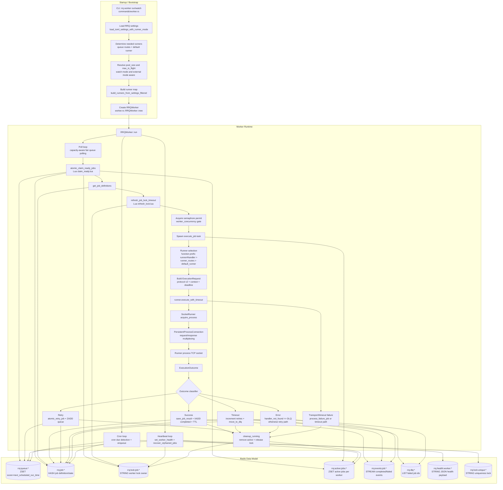

# RRQ Architecture

This document is derived from the current Rust source, primarily:

- `rrq-rs/orchestrator/src/commands/worker.rs`
- `rrq-rs/orchestrator/src/worker.rs`
- `rrq-rs/orchestrator/src/runner.rs`
- `rrq-rs/orchestrator/src/store.rs`
- `rrq-rs/orchestrator/src/lua/*.lua`
- `rrq-rs/orchestrator/src/client.rs`
- `rrq-rs/producer/src/lib.rs`
- `rrq-rs/runner/src/runtime.rs`
- `rrq-rs/runner/src/registry.rs`
- `rrq-rs/protocol/src/lib.rs`

## Orchestrator Architecture (`rrq-rs/orchestrator`)



## Producer Flowchart (`rrq-rs/producer`)

```mermaid
flowchart TD
    A[Producer::enqueue / enqueue_with_rate_limit / enqueue_with_debounce] --> B[Validate function/queue/key inputs]
    B --> C[Resolve defaults\njob_id, queue, retries, timeout, TTL, schedule]
    C --> D[Build trace_context\nmerge caller + current span propagation]
    D --> E[Extract correlation_context\nfrom params + configured mappings]
    E --> F[Serialize params/trace/correlation JSON]

    F --> G{Enqueue mode}

    G --> H[Standard enqueue script\n(idempotency-aware)]
    H --> H1{Idempotency key exists?}
    H1 -->|yes and job exists| H2[Return existing job_id\nstatus=0]
    H1 -->|no| H3[Create job hash + optional contexts\nZADD queue score]
    H3 --> H4[Return created job_id\nstatus=1]
    H --> H5{job_id hash already exists?}
    H5 -->|yes| HX[Error: duplicate job_id\nstatus=-1]

    G --> I[Rate-limit enqueue script]
    I --> I1{SET rate_limit_key NX EX ttl succeeds?}
    I1 -->|no| I2[Drop enqueue\nreturn None status=2]
    I1 -->|yes| I3[Create job hash + ZADD queue\nreturn Some(job_id) status=1]
    I --> I4{job_id exists after lock?}
    I4 -->|yes| IX[Rollback rate key + error\nstatus=-1]

    G --> J[Debounce enqueue script]
    J --> J1{Debounce key points to pending job?}
    J1 -->|yes| J2[Update existing pending job payload + schedule\nZADD reschedule\nreturn existing id status=0]
    J1 -->|no| J3[SET debounce key NX EX\ncreate new job hash + ZADD queue\nstatus=1]
    J --> J4{job_id exists?}
    J4 -->|yes| JX[Error: duplicate job_id\nstatus=-1]

    H2 --> K[Return to caller]
    H4 --> K
    I2 --> K
    I3 --> K
    J2 --> K
    J3 --> K
    HX --> K
    IX --> K
    JX --> K

    subgraph wait[Optional: wait_for_completion]
        W1[wait_for_completion(job_id)] --> W2[Read job hash status]
        W2 --> W3{Terminal?\nCOMPLETED or FAILED}
        W3 -->|yes| W4[Return JobResult]
        W3 -->|no| W5[XREAD BLOCK on rrq:events:job:<id>]
        W5 --> W2
        W1 --> W6{Deadline exceeded?}
        W6 -->|yes| W7[Return None timeout]
    end
```

## Runner Flowchart (`rrq-rs/runner`)

```mermaid
flowchart TD
    A[RunnerRuntime::new] --> B[Install parent_lifecycle_guard]
    B --> C[parse_tcp_socket]
    C --> D{Loopback addr?}
    D -->|no| E[Fail startup]
    D -->|yes| F[run_tcp_loop: bind TcpListener]

    F --> G[Accept TCP connection]
    G --> H[handle_connection\n(reader/writer split + response channel)]

    H --> I[Read framed RunnerMessage]
    I --> J{Message type}

    J -->|Request| K[Validate protocol_version == 2]
    K --> L{In-flight per connection < 64?}
    L -->|no| M[Send error outcome: runner busy]
    L -->|yes| N[Track request_id in\nconnection_requests + in_flight + job_index]
    N --> O[Spawn execute_with_deadline task]

    O --> P{deadline in request.context?}
    P -->|expired| Q[Return timeout outcome]
    P -->|valid| R[timeout(remaining, registry.execute_with)]
    R --> S{Handler registered?}
    S -->|yes| T[Execute handler future]
    S -->|no| U[handler_not_found error outcome]
    T --> V[Normalize outcome\nensure job_id/request_id present]
    U --> V
    Q --> V

    V --> W[Send Response via channel (timeout-guarded)]
    W --> X[Cleanup maps/metrics\nin_flight, job_index, channel pressure]
    X --> I

    J -->|Cancel| Y[Resolve targets by request_id or all request_ids for job_id]
    Y --> Z[Abort matching in-flight task(s)]
    Z --> ZA[Send cancelled error outcome(s)]
    ZA --> ZB[Cleanup maps/metrics]
    ZB --> I

    J -->|Response| ZZ[Send protocol error outcome\nunexpected response from orchestrator]
    ZZ --> I

    I -->|EOF / disconnect| ZC[Abort outstanding requests for this connection]
    ZC --> ZD[Cleanup maps/metrics + close writer task]
```
